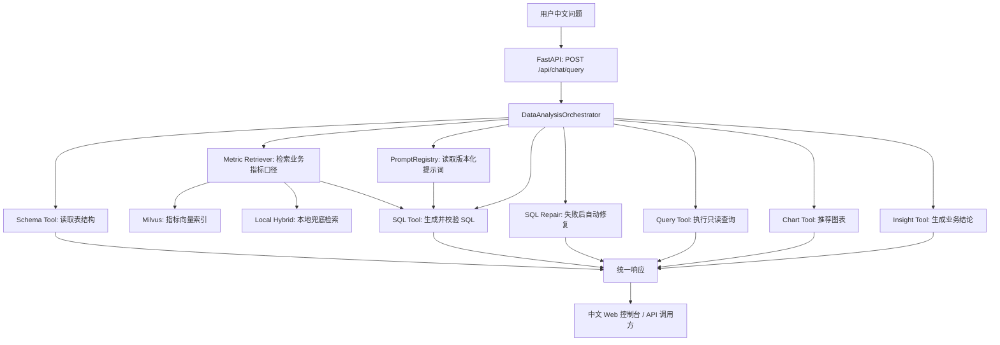

# DataWhisperer

DataWhisperer 是一个面向业务人员的自然语言数据分析智能体。用户可以用中文提出数据问题，系统自动读取 MySQL 示例库结构，生成安全 SQL，执行查询，并返回表格、图表和业务分析结论。

当前项目已经更新到 **V3.6.3：分析体验增强控制台细节优化版本**。

版本入口：

- `v1.0.0`：Text-to-SQL MVP，跑通自然语言查数、SQL 安全校验、查询执行、图表和分析结论。
- `v2.0.0`：引入 PromptOps、SQL 自动修复和基础评测集，使系统具备更强的可治理、可追踪和可评测能力。
- `v3.0.0`：引入本地指标口径库和轻量检索，将 GMV、销售额、客单价、订单数、复购率等业务定义注入 SQL 生成 prompt。
- `v3.1.0`：升级为混合指标检索，结合关键词/别名命中和轻量 n-gram 相似度。
- `v3.2.0`：新增指标检索评测集，验证问题是否命中正确业务指标。
- `v3.3.0`：接入 Milvus 向量数据库作为指标检索层，并保留本地检索自动兜底。
- `v3.4.0`：将指标向量化升级为 DashScope `text-embedding-v4`，Milvus 索引使用真实语义向量。
- `v3.5.0`：升级中文控制台，新增数据结构资料和 RAG 知识库资料的上传、列表、预览、删除能力。
- `v3.6.0`：增强分析体验，加入可展开时间线、结论逐字输出、图表交互、统一动效和追问建议。
- `v3.6.1`：优化 AI 查数页面，分析结论限制在卡片内部滚动，分析过程默认收起，并移除重复的轨迹页签。
- `v3.6.2`：继续优化 AI 查数页面，分析结论卡片随内容自然撑开，收起的分析过程展示实时进度摘要。
- `v3.6.3`：优化分析结论阅读区样式，追问建议默认折叠，避免干扰主分析结果。

项目第一阶段重点不是堆概念，而是先做出一个能真实跑通的 Text-to-SQL 数据分析闭环。V2 补充大模型工程化能力，V3 开始加入 RAG 业务知识增强，后续会继续扩展 MCP 工具化和多智能体协作。

## 项目亮点

- 自然语言转 MySQL `SELECT` 查询。
- 自动读取数据库表、字段、主键、外键信息。
- 服务端 SQL 安全校验，禁止写入、删除、DDL、多语句和危险函数。
- 自动补充 `LIMIT`，避免一次性返回过多数据。
- 返回查询表格、ECharts 图表配置、业务分析结论和执行轨迹。
- 提供中文 Web 控制台，便于演示和面试讲解。
- LLM 使用 OpenAI-compatible 封装，默认适配 DashScope/Qwen，也可以切换 OpenAI、DeepSeek 等兼容服务。
- 没有配置大模型 API Key 时，部分典型问题会走演示兜底规则，方便本地快速验证。
- V2 引入 PromptOps，将 SQL 生成、SQL 修复、分析总结、图表推荐 prompt 拆成版本化模板。
- SQL 校验失败或数据库执行失败时，系统最多自动修复 1 次，并记录 `repair_count`。
- 内置基础 Text-to-SQL 评测集，可快速检查 SQL 安全、关键 SQL 片段和图表推荐是否退化。
- V3 引入本地指标口径库，支持 GMV、销售额、客单价、订单数、复购率等业务指标检索。
- SQL 生成和 SQL 修复 prompt 会注入检索到的指标口径，让模型按业务定义生成 SQL。
- API 返回 `retrieved_metrics`，方便追踪本次问题参考了哪些业务指标定义。
- V3.1 使用混合检索策略：关键词/别名精确匹配 + 本地 n-gram 语义相似度。
- V3.2 增加指标检索评测集，检查指标召回是否正确、是否误召回禁止指标。
- V3.3 增加 Milvus 向量数据库检索层，指标 Markdown 仍作为知识源，Milvus 作为可重建索引。
- Milvus 未启动、未安装客户端或索引未同步时，系统可自动回退到本地 hybrid 检索，避免演示环境阻塞。
- V3.4 使用 DashScope `text-embedding-v4` 生成指标向量，hashing 向量化器保留为本地兜底。
- V3.5 将控制台拆成 AI 查数、数据结构、RAG 知识库三个工作区。
- 支持数据结构资料和 RAG 知识库资料上传、列表查看、文本预览和删除。
- V3.6 将执行步骤升级为可展开分析时间线，展示从理解问题到生成结论的完整过程。
- V3.6 支持分析结论逐字输出、图表缩放/保存/点击反馈和自动追问建议。
- V3.6.1 优化 AI 查数页面的信息密度，减少重复轨迹展示，让业务结论和分析过程更适合演示场景。
- V3.6.2 让分析结论区域按内容自适应高度，并在分析过程收起时保留“正在处理/已完成”的状态感知。
- V3.6.3 将追问建议改为默认折叠入口，并优化分析结论正文的内边距、背景和阅读层次。

## 技术栈

- 后端：FastAPI、Pydantic、SQLAlchemy
- 数据库：MySQL 8
- 向量数据库：Milvus standalone
- 大模型：OpenAI-compatible Chat Completions，默认 DashScope/Qwen
- Embedding：DashScope `text-embedding-v4`
- 前端：FastAPI StaticFiles、原生 HTML/CSS/JavaScript、ECharts
- 测试：pytest、ruff
- 部署辅助：Docker Compose

## 架构概览



核心设计思想：

- API 层保持轻量，只负责请求、响应和异常转换。
- Orchestrator 负责编排完整 Agent 流程。
- Tools 负责具体能力，后续可以平滑升级成 MCP 工具。
- Prompt 不是安全边界，SQL 安全必须由服务端代码兜底。
- 返回 `trace_steps`，方便调试和向面试官解释每一步发生了什么。
- 返回 `prompt_versions` 和 `repair_count`，用于追踪本次请求使用的提示词版本和 SQL 修复次数。
- 返回 `retrieved_metrics`，用于追踪本次请求检索到的业务指标口径。

## 目录结构

```text
app/
  api/          FastAPI 路由
  agent/        Agent 主控编排流程
  core/         配置、数据库、大模型客户端
  evals/        Text-to-SQL 评测 runner
  models/       Pydantic 请求/响应模型
  rag/          指标口径检索、向量化、Milvus 同步工具
  tools/        Schema、SQL、查询、图表、分析工具
docs/
  architecture.md       架构说明
  interview-guide.md    面试讲解稿
  v1-release-notes.md   v1 发布说明
  v2-promptops-design.md V2 PromptOps 设计说明
  v3-rag-metrics-design.md V3 RAG 指标口径库设计说明
evals/
  text_to_sql_cases.json 基础 Text-to-SQL 评测集
  metric_retrieval_cases.json 指标检索评测集
knowledge/
  metrics/              GMV、销售额、客单价、订单数、复购率等指标口径
prompts/
  sql_generation/       SQL 生成提示词模板
  sql_repair/           SQL 修复提示词模板
  insight_summary/      分析总结提示词模板
  chart_recommendation/ 图表推荐提示词模板
scripts/
  mysql_sample.sql      示例电商销售数据库
static/
  index.html            中文控制台页面
storage/
  schema_files/          数据结构资料上传目录，已加入 .gitignore
  rag_knowledge/         RAG 知识库资料上传目录，已加入 .gitignore
tests/
  单元测试和接口契约测试
```

## 快速启动

### 1. 创建 Python 环境

```powershell
cd F:\Al_development\DataWhisperer
python -m venv .venv
.\.venv\Scripts\Activate.ps1
pip install -e .[dev]
```

如果 PowerShell 对 `.[dev]` 解析有问题，可以改用：

```powershell
pip install -r requirements-dev.txt
```

### 2. 配置环境变量

```powershell
copy .env.example .env
notepad .env
```

DashScope/Qwen 示例配置：

```env
DASHSCOPE_API_KEY=你的 DashScope API Key
DASHSCOPE_API_BASE=https://dashscope.aliyuncs.com/compatible-mode/v1
DASHSCOPE_MODEL=qwen-plus
DASHSCOPE_EMBEDDING_MODEL=text-embedding-v4
DASHSCOPE_EMBEDDING_DIMENSION=1024
```

说明：

- `.env.example` 是模板文件，可以提交到 GitHub。
- `.env` 是本地真实配置文件，已经加入 `.gitignore`。
- 不要把真实 API Key 提交到 GitHub。
- V3.4 后聊天模型和 embedding 默认都可以复用 `DASHSCOPE_API_KEY`。

### 3. 启动 MySQL 示例库

推荐使用：

```powershell
docker-compose up -d mysql
```

部分环境也可以使用：

```powershell
docker compose up -d mysql
```

第一次启动时，MySQL 会自动执行：

```text
scripts/mysql_sample.sql
```

示例数据会写入：

```text
volumes/mysql/
```

这个目录已经加入 `.gitignore`。

### 4. 可选：启动 Milvus 指标向量库

默认情况下项目使用本地 hybrid 指标检索，可以直接运行。
如果想演示 V3.4 的 Milvus + DashScope Embedding 向量检索能力，可以启动 Milvus 并同步指标索引：

```powershell
pip install -e ".[milvus]"
docker-compose up -d etcd minio milvus
python -m app.rag.milvus_sync
```

然后在 `.env` 中切换检索提供方：

```env
METRIC_RETRIEVAL_PROVIDER=milvus
EMBEDDING_PROVIDER=dashscope
DASHSCOPE_EMBEDDING_MODEL=text-embedding-v4
DASHSCOPE_EMBEDDING_DIMENSION=1024
MILVUS_URI=http://127.0.0.1:19530
MILVUS_METRIC_COLLECTION=datawhisperer_metrics
MILVUS_AUTO_FALLBACK=true
```

说明：

- `knowledge/metrics/*.md` 仍然是指标口径的唯一知识源。
- Milvus 只保存可重建的向量索引，不保存不可恢复的业务配置。
- V3.4 使用 `text-embedding-v4` 生成 1024 维指标向量，旧的 128 维 hashing 索引需要重新同步。
- `MILVUS_AUTO_FALLBACK=true` 时，Milvus 不可用会自动回退到本地检索。

### 5. 启动后端服务

```powershell
uvicorn app.main:app --reload --port 8081
```

访问地址：

- 控制台：http://127.0.0.1:8081/
- Swagger 文档：http://127.0.0.1:8081/docs
- 健康检查：http://127.0.0.1:8081/api/health
- 示例问题：http://127.0.0.1:8081/api/examples
- 数据结构：http://127.0.0.1:8081/api/schema/overview
- 数据结构资料文件：http://127.0.0.1:8081/api/files/schema
- RAG 知识库资料文件：http://127.0.0.1:8081/api/files/rag

## 主要接口

### `GET /api/health`

用于检查服务是否正常启动。

### `GET /api/schema/overview`

读取当前 MySQL 示例库的表结构摘要，包括表名、字段、字段类型、主键和外键。

### `GET /api/examples`

返回内置演示问题，前端左侧的示例问题列表来自这个接口。

### `POST /api/chat/query`

自然语言查数主入口。

请求示例：

```json
{
  "question": "查询各地区订单数量",
  "max_rows": 100
}
```

响应字段：

- `generated_sql`：最终执行的安全 SQL。
- `sql_explanation`：SQL 的作用说明。
- `columns`：结果列名。
- `rows`：查询结果。
- `chart`：ECharts 图表配置。
- `insight`：业务分析结论。
- `warnings`：风险提示或兜底说明。
- `trace_steps`：Agent 执行轨迹。
- `prompt_versions`：本次请求使用过的 prompt 版本。
- `retrieved_metrics`：本次请求检索到的业务指标口径。
- `repair_count`：SQL 自动修复次数。

### 文件管理接口

V3.5 新增两组资料管理接口：

```text
GET    /api/files/schema
POST   /api/files/schema
GET    /api/files/schema/{file_id}/preview
DELETE /api/files/schema/{file_id}

GET    /api/files/rag
POST   /api/files/rag
GET    /api/files/rag/{file_id}/preview
DELETE /api/files/rag/{file_id}
```

当前文件上传用于资料管理和控制台展示。后续版本可以继续接入自动解析、CSV 入库、RAG 切片和 Milvus 索引同步。

## 示例问题

也可以通过 `GET /api/examples` 获取。

- 查询最近 6 个月每月销售额趋势
- 查询各商品品类销售额占比
- 哪个地区客单价最高
- 找出销售额下滑最明显的商品
- 查询华东地区销量前三的商品及其环比增长
- 查询各地区订单数量
- 统计每个行业的客户数量

## SQL 安全策略

DataWhisperer 第一阶段只允许只读分析查询。

服务端会拦截：

- `INSERT`
- `UPDATE`
- `DELETE`
- `DROP`
- `ALTER`
- `TRUNCATE`
- 多语句 SQL
- SQL 注释
- 导出文件类语句

同时会自动给没有 `LIMIT` 的查询补上行数限制。

这里体现了一个重要原则：

> 提示词不是安全边界，服务端代码才是安全边界。

## 测试

```powershell
pytest
ruff check .
```

当前测试覆盖：

- SQL 安全校验
- 图表推荐规则
- 示例问题接口
- API 路由契约
- PromptRegistry 提示词模板渲染
- SQL 自动修复链路
- Text-to-SQL 基础评测集
- RAG 指标口径检索
- 指标检索评测集
- V3.4 DashScope embedding 客户端和 hashing 本地兜底
- Milvus 指标检索命中与本地检索兜底
- Milvus 指标文档同步构造
- V3.5 文件上传、预览、删除和 API 路由契约

运行基础评测：

```powershell
python -m app.evals.text_to_sql
```

运行指标检索评测：

```powershell
python -m app.evals.metric_retrieval
```

当前评测结果：

```text
total: 5
passed: 5
failed: 0
pass_rate: 1.0
```

## 面试讲法

可以用下面这段作为 1 分钟项目介绍：

> DataWhisperer 是我做的一个 Text-to-SQL 数据分析智能体。它面向没有 SQL 能力的业务用户，用户输入中文问题后，系统会读取 MySQL 表结构，并检索 GMV、客单价、复购率等业务指标口径，再调用大模型生成查询 SQL。服务端安全层只允许只读查询，SQL 失败时最多自动修复一次，最后返回表格、图表配置和业务分析结论。V2 引入 PromptOps 和 SQL 自修复，V3 引入 RAG 指标口径库，V3.4 使用 DashScope text-embedding-v4 和 Milvus 做语义检索，V3.5 将前端升级为三工作区控制台，V3.6 增强分析体验，加入可展开时间线、逐字输出、图表交互和追问建议，使系统从“能跑通”升级为“可治理、可追踪、可评测、能理解业务指标、具备向量检索基础设施和产品化交互体验”的大模型工程项目。

更多讲解内容见：[docs/interview-guide.md](docs/interview-guide.md)。

## 常见问题

### 配了 API Key，但页面仍然提示用了演示兜底规则

先确认 Key 是否写到了 `.env`，而不是只写在 `.env.example`。

修改 `.env` 后需要重启服务。

### MySQL 容器启动后马上退出

如果日志里出现：

```text
--initialize specified but the data directory has files in it
```

说明 MySQL 第一次初始化失败后留下了半初始化数据。对于本项目 demo，可以删除：

```text
volumes/mysql/
```

然后重新启动：

```powershell
docker-compose up -d mysql
```

如果日志里出现：

```text
No space left on device
```

说明 Docker 原来的 named volume 空间不足。本项目已经改为使用 `./volumes/mysql` 绑定目录，通常可以避免这个问题。

### 8080 被旧服务占用

可以换端口启动：

```powershell
uvicorn app.main:app --reload --port 8081
```

当前推荐使用 8081。

### Milvus 没启动时还能运行吗

可以。默认 `METRIC_RETRIEVAL_PROVIDER=local`，系统会使用本地 hybrid 检索。

如果切到 `METRIC_RETRIEVAL_PROVIDER=milvus`，但 Milvus 没启动或指标索引没同步，只要
`MILVUS_AUTO_FALLBACK=true`，系统会自动回退到本地 hybrid 检索，保证核心查数流程不被阻塞。

## 后续路线

- V1：Text-to-SQL MVP，跑通自然语言查数闭环。
- V2：PromptOps 提示词治理、SQL 自动修复、基础 Text-to-SQL 评测集。
- V3：RAG 指标口径库，支持 GMV、客单价、复购率等业务定义检索和 prompt 注入。
- V3.1：混合指标检索，结合关键词/别名命中和轻量 n-gram 相似度。
- V3.2：指标检索评测集，验证指标召回、误召回和报告输出。
- V3.3：Milvus 向量数据库检索层，支持指标向量索引同步和本地检索兜底。
- V3.4：DashScope `text-embedding-v4` 指标向量化，Milvus 使用真实语义向量检索。
- V3.5：产品控制台升级，新增数据结构资料和 RAG 知识库资料管理页面。
- V3.6：分析体验增强，加入时间线、逐字输出、图表交互、统一动效和追问建议。
- V3.7：RAG 上传文件自动切片并同步 Milvus，数据结构上传文件接入 schema 解析。
- V4：MCP 工具化，把数据库查询、图表生成、导出能力包装成工具。
- V5：多智能体拆分，引入 Schema Analyst、SQL Engineer、Chart Designer、Report Writer。
- V6：评测体系增强，增加真实 LLM 评测、SQL 正确率、修复成功率和分析结论质量评估。
