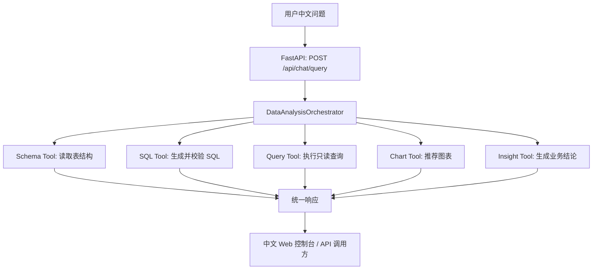

# DataWhisperer

DataWhisperer 是一个面向业务人员的自然语言数据分析智能体。用户可以用中文提出数据问题，系统自动读取 MySQL 示例库结构，生成安全 SQL，执行查询，并返回表格、图表和业务分析结论。

这个项目的第一阶段重点不是堆概念，而是先做出一个能真实跑通的 Text-to-SQL 数据分析闭环。后续可以继续扩展提示词治理、RAG 指标知识库、MCP 工具化和多智能体协作。

## 项目亮点

- 自然语言转 MySQL `SELECT` 查询。
- 自动读取数据库表、字段、主键、外键信息。
- 服务端 SQL 安全校验，禁止写入、删除、DDL、多语句和危险函数。
- 自动补充 `LIMIT`，避免一次性返回过多数据。
- 返回查询表格、ECharts 图表配置、业务分析结论和执行轨迹。
- 提供中文 Web 控制台，便于演示和面试讲解。
- LLM 使用 OpenAI-compatible 封装，默认适配 DashScope/Qwen，也可以切换 OpenAI、DeepSeek 等兼容服务。
- 没有配置大模型 API Key 时，部分典型问题会走演示兜底规则，方便本地快速验证。

## 技术栈

- 后端：FastAPI、Pydantic、SQLAlchemy
- 数据库：MySQL 8
- 大模型：OpenAI-compatible Chat Completions，默认 DashScope/Qwen
- 前端：FastAPI StaticFiles、原生 HTML/CSS/JavaScript、ECharts
- 测试：pytest、ruff
- 部署辅助：Docker Compose

## 架构概览



核心设计思想：

- API 层保持轻量，只负责请求、响应和异常转换。
- Orchestrator 负责编排完整 Agent 流程。
- Tools 负责具体能力，后续可以平滑升级成 MCP 工具。
- Prompt 不是安全边界，SQL 安全必须由服务端代码兜底。
- 返回 `trace_steps`，方便调试和向面试官解释每一步发生了什么。

## 目录结构

```text
app/
  api/          FastAPI 路由
  agent/        Agent 主控编排流程
  core/         配置、数据库、大模型客户端
  models/       Pydantic 请求/响应模型
  tools/        Schema、SQL、查询、图表、分析工具
docs/
  architecture.md       架构说明
  interview-guide.md    面试讲解稿
  v1-release-notes.md   v1 发布说明
scripts/
  mysql_sample.sql      示例电商销售数据库
static/
  index.html            中文控制台页面
tests/
  单元测试和接口契约测试
```

## 快速启动

### 1. 创建 Python 环境

```powershell
cd F:\Al_development\DataWhisperer
python -m venv .venv
.\.venv\Scripts\Activate.ps1
pip install -e .[dev]
```

如果 PowerShell 对 `.[dev]` 解析有问题，可以改用：

```powershell
pip install -r requirements-dev.txt
```

### 2. 配置环境变量

```powershell
copy .env.example .env
notepad .env
```

DashScope/Qwen 示例配置：

```env
LLM_BASE_URL=https://dashscope.aliyuncs.com/compatible-mode/v1
LLM_MODEL=qwen-plus
LLM_API_KEY=你的 DashScope API Key
```

说明：

- `.env.example` 是模板文件，可以提交到 GitHub。
- `.env` 是本地真实配置文件，已经加入 `.gitignore`。
- 不要把真实 API Key 提交到 GitHub。

### 3. 启动 MySQL 示例库

推荐使用：

```powershell
docker-compose up -d mysql
```

部分环境也可以使用：

```powershell
docker compose up -d mysql
```

第一次启动时，MySQL 会自动执行：

```text
scripts/mysql_sample.sql
```

示例数据会写入：

```text
volumes/mysql/
```

这个目录已经加入 `.gitignore`。

### 4. 启动后端服务

```powershell
uvicorn app.main:app --reload --port 8081
```

访问地址：

- 控制台：http://127.0.0.1:8081/
- Swagger 文档：http://127.0.0.1:8081/docs
- 健康检查：http://127.0.0.1:8081/api/health
- 示例问题：http://127.0.0.1:8081/api/examples
- 数据结构：http://127.0.0.1:8081/api/schema/overview

## 主要接口

### `GET /api/health`

用于检查服务是否正常启动。

### `GET /api/schema/overview`

读取当前 MySQL 示例库的表结构摘要，包括表名、字段、字段类型、主键和外键。

### `GET /api/examples`

返回内置演示问题，前端左侧的示例问题列表来自这个接口。

### `POST /api/chat/query`

自然语言查数主入口。

请求示例：

```json
{
  "question": "查询各地区订单数量",
  "max_rows": 100
}
```

响应字段：

- `generated_sql`：最终执行的安全 SQL。
- `sql_explanation`：SQL 的作用说明。
- `columns`：结果列名。
- `rows`：查询结果。
- `chart`：ECharts 图表配置。
- `insight`：业务分析结论。
- `warnings`：风险提示或兜底说明。
- `trace_steps`：Agent 执行轨迹。

## 示例问题

也可以通过 `GET /api/examples` 获取。

- 查询最近 6 个月每月销售额趋势
- 查询各商品品类销售额占比
- 哪个地区客单价最高
- 找出销售额下滑最明显的商品
- 查询华东地区销量前三的商品及其环比增长
- 查询各地区订单数量
- 统计每个行业的客户数量

## SQL 安全策略

DataWhisperer 第一阶段只允许只读分析查询。

服务端会拦截：

- `INSERT`
- `UPDATE`
- `DELETE`
- `DROP`
- `ALTER`
- `TRUNCATE`
- 多语句 SQL
- SQL 注释
- 导出文件类语句

同时会自动给没有 `LIMIT` 的查询补上行数限制。

这里体现了一个重要原则：

> 提示词不是安全边界，服务端代码才是安全边界。

## 测试

```powershell
pytest
ruff check .
```

当前测试覆盖：

- SQL 安全校验
- 图表推荐规则
- 示例问题接口
- API 路由契约

## 面试讲法

可以用下面这段作为 1 分钟项目介绍：

> DataWhisperer 是我做的一个 Text-to-SQL 数据分析智能体。它面向没有 SQL 能力的业务用户，用户输入中文问题后，系统会读取 MySQL 表结构，调用大模型生成查询 SQL，再由服务端安全层校验，只允许只读查询，最后执行 SQL 并返回表格、图表配置和业务分析结论。这个项目的重点是把大模型能力真正接入到一个可运行的数据分析工作流里，同时考虑了 SQL 安全、工具拆分、执行轨迹和后续 MCP、多智能体扩展。

更多讲解内容见：[docs/interview-guide.md](docs/interview-guide.md)。

## 常见问题

### 配了 API Key，但页面仍然提示用了演示兜底规则

先确认 Key 是否写到了 `.env`，而不是只写在 `.env.example`。

修改 `.env` 后需要重启服务。

### MySQL 容器启动后马上退出

如果日志里出现：

```text
--initialize specified but the data directory has files in it
```

说明 MySQL 第一次初始化失败后留下了半初始化数据。对于本项目 demo，可以删除：

```text
volumes/mysql/
```

然后重新启动：

```powershell
docker-compose up -d mysql
```

如果日志里出现：

```text
No space left on device
```

说明 Docker 原来的 named volume 空间不足。本项目已经改为使用 `./volumes/mysql` 绑定目录，通常可以避免这个问题。

### 8080 被旧服务占用

可以换端口启动：

```powershell
uvicorn app.main:app --reload --port 8081
```

当前推荐使用 8081。

## 后续路线

- V1.1：补充更完整的项目文档、截图、接口示例和面试讲解材料。
- V2：提示词模板管理，把 SQL 生成、图表推荐、分析总结 prompt 独立版本化。
- V3：RAG 指标口径库，支持 GMV、客单价、复购率等业务定义检索。
- V4：MCP 工具化，把数据库查询、图表生成、导出能力包装成工具。
- V5：多智能体拆分，引入 Schema Analyst、SQL Engineer、Chart Designer、Report Writer。
- V6：评测体系，增加 Text-to-SQL 正确率、SQL 安全、图表选择、分析结论质量评估。
