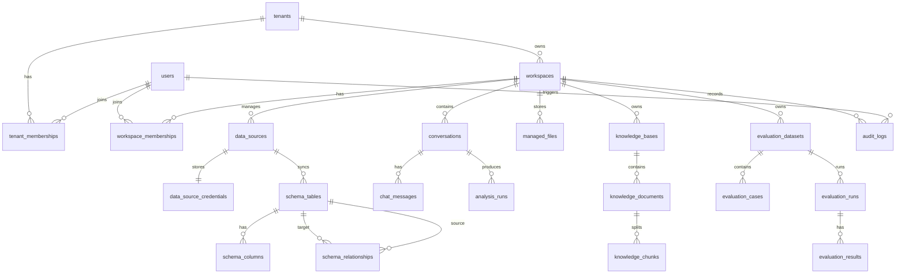

# DataWhisperer V3.13 产品数据模型设计

## 1. 这一版先解决什么问题

前面版本已经把 Text-to-SQL、RAG 资料管理、评测中心、3D 数据关系图谱和登录页做出来了。现在最重要的不是继续堆 MCP 或多智能体，而是先把产品底座设计清楚。

V3.13 的目标是把 DataWhisperer 从“单人本地演示工具”规划成“可继续演进为多租户 SaaS 产品”的结构。

这一版先做设计文档，暂时不直接改数据库和后端业务代码。原因是：数据库模型一旦设计得比较稳，后面的前端页面、后端接口、权限体系、RAG 知识库、评测中心都会更顺。

## 2. 产品边界

DataWhisperer 后续可以理解成一个企业数据分析工作台：

- 一个公司或团队是一个租户。
- 一个租户下面可以有多个工作空间。
- 一个工作空间可以连接多个数据源。
- 用户在工作空间里上传资料、同步表结构、发起 AI 查数、维护知识库和运行评测。
- 所有数据都要围绕租户和工作空间隔离，避免 A 团队看到 B 团队的数据。

简单理解：

```text
租户 tenant
  -> 工作空间 workspace
      -> 数据源 data_source
      -> 数据结构 schema
      -> AI 查数 conversation
      -> RAG 知识库 knowledge_base
      -> 评测中心 evaluation
```

## 3. 总体 E-R 图



这张图表达的是产品的主干。后面接 MCP、多智能体时，不应该破坏这套底座，而是在 `workspaces` 下面增加工具、任务和智能体运行记录。

## 4. 多租户模型

### 4.1 tenants

租户代表一个组织、公司或团队。登录页里的“工作空间 / 租户标识”最终应该对应到租户或工作空间。

| 字段 | 类型 | 说明 |
| --- | --- | --- |
| id | bigint | 主键 |
| tenant_key | varchar(64) | 租户唯一标识，例如 demo、acme-retail |
| name | varchar(128) | 租户名称 |
| plan | varchar(32) | 套餐，free、team、enterprise |
| status | varchar(32) | active、disabled、trial |
| created_at | datetime | 创建时间 |
| updated_at | datetime | 更新时间 |

设计原因：

- `tenant_key` 用于登录、URL、日志和接口传参，比直接暴露数字 id 更友好。
- 后续做 SaaS 套餐、租户禁用、资源配额时都放在这里。

### 4.2 users

用户是一个真实账号。一个用户可以加入多个租户，这样更贴近企业协作产品。

| 字段 | 类型 | 说明 |
| --- | --- | --- |
| id | bigint | 主键 |
| email | varchar(128) | 登录邮箱，唯一 |
| display_name | varchar(64) | 展示名称 |
| avatar_url | varchar(512) | 头像地址 |
| password_hash | varchar(255) | 密码哈希 |
| status | varchar(32) | active、locked、disabled |
| last_login_at | datetime | 最近登录时间 |
| created_at | datetime | 创建时间 |
| updated_at | datetime | 更新时间 |

设计原因：

- 密码只保存哈希，不保存明文。
- 头像建议保存对象存储地址，不建议直接存大体积 base64。

### 4.3 tenant_memberships

用户和租户之间是多对多关系。这个表记录用户在租户里的角色。

| 字段 | 类型 | 说明 |
| --- | --- | --- |
| id | bigint | 主键 |
| tenant_id | bigint | 租户 id |
| user_id | bigint | 用户 id |
| role | varchar(32) | owner、admin、analyst、viewer |
| status | varchar(32) | active、invited、removed |
| joined_at | datetime | 加入时间 |

设计原因：

- 以后做成员管理、邀请成员、权限控制都靠它。
- 角色先做粗粒度，后续再细化权限点。

### 4.4 workspaces

工作空间是用户日常使用产品的主入口。一个租户可以有多个工作空间，例如“销售分析”“供应链分析”“财务分析”。

| 字段 | 类型 | 说明 |
| --- | --- | --- |
| id | bigint | 主键 |
| tenant_id | bigint | 所属租户 |
| workspace_key | varchar(64) | 工作空间唯一标识 |
| name | varchar(128) | 工作空间名称 |
| description | varchar(512) | 描述 |
| default_data_source_id | bigint | 默认数据源 |
| status | varchar(32) | active、archived |
| created_by | bigint | 创建人 |
| created_at | datetime | 创建时间 |
| updated_at | datetime | 更新时间 |

设计原因：

- 现在前端顶部“工作空间：示例数据空间”后续就来自这里。
- AI 查数、RAG、评测、文件都应该挂在 workspace 下。

### 4.5 workspace_memberships

如果租户角色还不够细，可以在工作空间内继续控制成员权限。

| 字段 | 类型 | 说明 |
| --- | --- | --- |
| id | bigint | 主键 |
| workspace_id | bigint | 工作空间 id |
| user_id | bigint | 用户 id |
| role | varchar(32) | admin、analyst、viewer |
| created_at | datetime | 创建时间 |

第一阶段可以先不实现这个表，先用 `tenant_memberships` 的角色控制。等产品变复杂后再加。

## 5. 数据源与 Schema 模型

### 5.1 data_sources

数据源表示一个业务数据库连接，例如 MySQL 示例库、公司订单库、CRM 库。

| 字段 | 类型 | 说明 |
| --- | --- | --- |
| id | bigint | 主键 |
| tenant_id | bigint | 所属租户 |
| workspace_id | bigint | 所属工作空间 |
| name | varchar(128) | 数据源名称 |
| db_type | varchar(32) | mysql、postgresql、sqlite |
| host | varchar(255) | 主机 |
| port | int | 端口 |
| database_name | varchar(128) | 数据库名 |
| username | varchar(128) | 用户名 |
| status | varchar(32) | connected、failed、disabled |
| last_checked_at | datetime | 最近检测时间 |
| created_by | bigint | 创建人 |
| created_at | datetime | 创建时间 |
| updated_at | datetime | 更新时间 |

设计原因：

- 页面“系统设置 -> 数据源配置”应该最终操作这个表。
- 密码不放这里，避免列表查询或日志误泄露。

### 5.2 data_source_credentials

连接密钥单独存储。

| 字段 | 类型 | 说明 |
| --- | --- | --- |
| id | bigint | 主键 |
| data_source_id | bigint | 数据源 id |
| encrypted_password | text | 加密密码 |
| encryption_version | varchar(32) | 加密版本 |
| rotated_at | datetime | 最近轮换时间 |
| created_at | datetime | 创建时间 |

设计原因：

- 后续接真实后端时，这张表要使用服务端密钥加密。
- 前端永远不应该拿到真实密码，只能提交或更新。

### 5.3 schema_tables

同步后的数据库表信息。

| 字段 | 类型 | 说明 |
| --- | --- | --- |
| id | bigint | 主键 |
| data_source_id | bigint | 数据源 id |
| table_name | varchar(128) | 表名 |
| table_comment | varchar(512) | 表注释 |
| table_type | varchar(32) | fact、dimension、bridge、unknown |
| row_count_estimate | bigint | 估算行数 |
| sync_version | varchar(64) | 同步版本 |
| synced_at | datetime | 同步时间 |

设计原因：

- 3D 关系图谱里的一个节点就是一条 `schema_tables`。
- `table_type` 可以决定图谱节点颜色，也可以帮助 SQL 生成理解事实表和维度表。

### 5.4 schema_columns

同步后的字段信息。

| 字段 | 类型 | 说明 |
| --- | --- | --- |
| id | bigint | 主键 |
| table_id | bigint | 表 id |
| column_name | varchar(128) | 字段名 |
| data_type | varchar(128) | 字段类型 |
| column_comment | varchar(512) | 字段注释 |
| is_primary_key | boolean | 是否主键 |
| is_nullable | boolean | 是否可空 |
| ordinal_position | int | 字段顺序 |
| semantic_type | varchar(64) | money、date、category、metric 等 |

设计原因：

- Text-to-SQL prompt 需要表名、字段名、类型、注释。
- 前端表详情抽屉里的字段列表来自这里。
- `semantic_type` 后续可以服务图表推荐和字段理解。

### 5.5 schema_relationships

表之间的主外键关系。

| 字段 | 类型 | 说明 |
| --- | --- | --- |
| id | bigint | 主键 |
| data_source_id | bigint | 数据源 id |
| source_table_id | bigint | 来源表 |
| source_column_id | bigint | 来源字段 |
| target_table_id | bigint | 目标表 |
| target_column_id | bigint | 目标字段 |
| relation_type | varchar(32) | many_to_one、one_to_many、one_to_one |
| confidence | decimal(5,4) | 置信度 |
| source | varchar(32) | database_fk、inferred、manual |
| created_at | datetime | 创建时间 |

设计原因：

- 数据库真实外键可能不完整，所以要支持 `inferred` 和 `manual`。
- 3D 图谱连线、表详情里的关联关系都来自这里。

## 6. AI 查数对话模型

### 6.1 conversations

一个会话对应左侧“最近对话”列表里的一个条目。

| 字段 | 类型 | 说明 |
| --- | --- | --- |
| id | bigint | 主键 |
| tenant_id | bigint | 租户 id |
| workspace_id | bigint | 工作空间 id |
| user_id | bigint | 创建用户 |
| title | varchar(128) | 会话标题 |
| summary | varchar(512) | 会话摘要 |
| status | varchar(32) | active、archived |
| created_at | datetime | 创建时间 |
| updated_at | datetime | 更新时间 |

### 6.2 chat_messages

会话消息。

| 字段 | 类型 | 说明 |
| --- | --- | --- |
| id | bigint | 主键 |
| conversation_id | bigint | 会话 id |
| role | varchar(32) | user、assistant、system |
| content | text | 消息正文 |
| content_type | varchar(32) | text、analysis_result |
| created_at | datetime | 创建时间 |

设计原因：

- 不要只保存结果，要保存完整对话。
- 后续多轮追问时，模型需要读取上下文。

### 6.3 analysis_runs

一次用户问题触发一次分析运行。

| 字段 | 类型 | 说明 |
| --- | --- | --- |
| id | bigint | 主键 |
| conversation_id | bigint | 会话 id |
| message_id | bigint | 用户消息 id |
| data_source_id | bigint | 使用的数据源 |
| question | text | 用户问题 |
| generated_sql | text | 生成 SQL |
| sql_explanation | text | SQL 解释 |
| result_columns | json | 查询字段 |
| result_rows_preview | json | 结果预览 |
| chart_option | json | ECharts 配置 |
| insight | text | 业务结论 |
| trace_steps | json | 执行过程 |
| warnings | json | 风险提示 |
| prompt_versions | json | 使用的 prompt 版本 |
| status | varchar(32) | success、failed、cancelled |
| duration_ms | int | 耗时 |
| created_at | datetime | 创建时间 |

设计原因：

- AI 查数结果应该可恢复、可审计、可复制到报告。
- 大结果不建议全部存在 MySQL，可以只存预览和文件地址。第一阶段先存 JSON 预览即可。

## 7. 文件与 RAG 模型

### 7.1 managed_files

统一管理上传文件。

| 字段 | 类型 | 说明 |
| --- | --- | --- |
| id | bigint | 主键 |
| tenant_id | bigint | 租户 id |
| workspace_id | bigint | 工作空间 id |
| category | varchar(32) | schema、rag、evaluation |
| original_name | varchar(255) | 原始文件名 |
| stored_path | varchar(512) | 存储路径 |
| mime_type | varchar(128) | 文件类型 |
| size_bytes | bigint | 文件大小 |
| uploaded_by | bigint | 上传用户 |
| status | varchar(32) | uploaded、parsed、failed、deleted |
| created_at | datetime | 上传时间 |

设计原因：

- 数据结构资料、RAG 资料、测试集都可以先复用文件管理能力。
- 当前前端三个上传页面后续都可以接这张表。

### 7.2 knowledge_bases

知识库是 RAG 的业务集合。

| 字段 | 类型 | 说明 |
| --- | --- | --- |
| id | bigint | 主键 |
| tenant_id | bigint | 租户 id |
| workspace_id | bigint | 工作空间 id |
| name | varchar(128) | 知识库名称 |
| description | varchar(512) | 描述 |
| milvus_collection | varchar(128) | Milvus collection |
| status | varchar(32) | active、syncing、failed |
| created_at | datetime | 创建时间 |

### 7.3 knowledge_documents

知识库里的文档。

| 字段 | 类型 | 说明 |
| --- | --- | --- |
| id | bigint | 主键 |
| knowledge_base_id | bigint | 知识库 id |
| file_id | bigint | 文件 id |
| title | varchar(255) | 文档标题 |
| parser | varchar(64) | 解析器 |
| chunk_count | int | 切片数量 |
| status | varchar(32) | parsed、indexed、failed |
| created_at | datetime | 创建时间 |

### 7.4 knowledge_chunks

文档切片元数据。

| 字段 | 类型 | 说明 |
| --- | --- | --- |
| id | bigint | 主键 |
| document_id | bigint | 文档 id |
| chunk_index | int | 切片序号 |
| content_preview | varchar(1024) | 切片预览 |
| token_count | int | token 数 |
| vector_id | varchar(128) | Milvus 向量 id |
| metadata | json | 额外元数据 |
| created_at | datetime | 创建时间 |

设计原因：

- MySQL 保存元数据，Milvus 保存向量。
- `vector_id` 用于从检索结果反查原文和文档信息。

## 8. 评测中心模型

### 8.1 evaluation_datasets

评测测试集。

| 字段 | 类型 | 说明 |
| --- | --- | --- |
| id | bigint | 主键 |
| tenant_id | bigint | 租户 id |
| workspace_id | bigint | 工作空间 id |
| name | varchar(128) | 测试集名称 |
| file_id | bigint | 上传文件 |
| case_count | int | 用例数量 |
| status | varchar(32) | ready、parsing、failed |
| created_by | bigint | 创建人 |
| created_at | datetime | 创建时间 |

### 8.2 evaluation_cases

单条评测用例。

| 字段 | 类型 | 说明 |
| --- | --- | --- |
| id | bigint | 主键 |
| dataset_id | bigint | 测试集 id |
| case_key | varchar(128) | 用例标识 |
| question | text | 自然语言问题 |
| expected_sql_contains | json | 期望 SQL 片段 |
| expected_metric | varchar(128) | 期望指标 |
| expected_chart_type | varchar(32) | 期望图表 |
| tags | json | 标签 |
| created_at | datetime | 创建时间 |

### 8.3 evaluation_runs

一次评测任务。

| 字段 | 类型 | 说明 |
| --- | --- | --- |
| id | bigint | 主键 |
| dataset_id | bigint | 测试集 id |
| workspace_id | bigint | 工作空间 id |
| model_name | varchar(128) | 模型 |
| prompt_version | varchar(64) | prompt 版本 |
| status | varchar(32) | running、success、failed |
| pass_rate | decimal(6,4) | 通过率 |
| duration_ms | int | 耗时 |
| created_by | bigint | 执行人 |
| created_at | datetime | 创建时间 |

### 8.4 evaluation_results

每条用例的评测结果。

| 字段 | 类型 | 说明 |
| --- | --- | --- |
| id | bigint | 主键 |
| run_id | bigint | 评测任务 id |
| case_id | bigint | 用例 id |
| status | varchar(32) | passed、failed |
| generated_sql | text | 生成 SQL |
| failure_reason | text | 失败原因 |
| checks | json | 检查项 |
| duration_ms | int | 单条耗时 |
| created_at | datetime | 创建时间 |

## 9. 审计与安全模型

### 9.1 audit_logs

审计日志记录关键操作。

| 字段 | 类型 | 说明 |
| --- | --- | --- |
| id | bigint | 主键 |
| tenant_id | bigint | 租户 id |
| workspace_id | bigint | 工作空间 id |
| user_id | bigint | 用户 id |
| action | varchar(128) | 操作，例如 run_query、upload_file、delete_file |
| target_type | varchar(64) | 目标类型 |
| target_id | varchar(64) | 目标 id |
| ip_address | varchar(64) | IP |
| user_agent | varchar(512) | 浏览器信息 |
| detail | json | 详情 |
| created_at | datetime | 创建时间 |

设计原因：

- 企业产品必须能回答“谁在什么时候查了什么数据”。
- 后续做安全审计、管理员后台和合规说明都需要它。

### 9.2 api_tokens

后续开放 API、MCP 或自动化任务时使用。

| 字段 | 类型 | 说明 |
| --- | --- | --- |
| id | bigint | 主键 |
| tenant_id | bigint | 租户 id |
| workspace_id | bigint | 工作空间 id |
| name | varchar(128) | token 名称 |
| token_hash | varchar(255) | token 哈希 |
| scopes | json | 权限范围 |
| expires_at | datetime | 过期时间 |
| created_by | bigint | 创建人 |
| created_at | datetime | 创建时间 |

第一阶段可以不做，但这个表的位置要提前想清楚。

## 10. 前端页面如何对应

| 前端页面 | 主要关联表 | 后续调整方向 |
| --- | --- | --- |
| 登录 / 注册 / 忘记密码 | tenants、users、tenant_memberships | 登录后选择租户和工作空间 |
| AI 查数 | conversations、chat_messages、analysis_runs、data_sources | 会话真正按用户和工作空间隔离 |
| 数据结构资料 | managed_files、schema_tables、schema_columns、schema_relationships | 文件管理和数据库结构同步分开 |
| 3D 关系图谱 | schema_tables、schema_columns、schema_relationships | 图谱从本地 schema API 变成读取同步后的结构表 |
| RAG 知识库 | managed_files、knowledge_bases、knowledge_documents、knowledge_chunks | 上传后自动解析、切片、同步 Milvus |
| 测试集管理 | managed_files、evaluation_datasets、evaluation_cases | 上传文件后解析成真实评测用例 |
| 评测中心 | evaluation_runs、evaluation_results | 展示历史评测任务和版本趋势 |
| 系统设置 | data_sources、data_source_credentials、users、tenant_memberships | 数据源、模型、账号和安全策略接真实后端 |

这个表很关键。它说明前端不是随便摆页面，而是每个页面背后都有对应的数据模型。

## 11. 后端接口规划

### 11.1 账号与租户

```text
POST /api/auth/login
POST /api/auth/register
POST /api/auth/forgot-password
POST /api/auth/logout
GET  /api/auth/me

GET  /api/tenants
GET  /api/workspaces
POST /api/workspaces
PATCH /api/workspaces/{workspace_id}
```

### 11.2 数据源与 Schema

```text
GET    /api/data-sources
POST   /api/data-sources
PATCH  /api/data-sources/{data_source_id}
DELETE /api/data-sources/{data_source_id}
POST   /api/data-sources/{data_source_id}/test
POST   /api/data-sources/{data_source_id}/sync-schema

GET    /api/schema/tables
GET    /api/schema/tables/{table_id}
GET    /api/schema/graph
```

### 11.3 AI 查数

```text
GET    /api/conversations
POST   /api/conversations
PATCH  /api/conversations/{conversation_id}
DELETE /api/conversations/{conversation_id}

GET    /api/conversations/{conversation_id}/messages
POST   /api/chat/query
GET    /api/analysis-runs/{run_id}
```

### 11.4 RAG 与评测

```text
GET    /api/knowledge-bases
POST   /api/knowledge-bases
POST   /api/knowledge-bases/{knowledge_base_id}/documents
POST   /api/knowledge-bases/{knowledge_base_id}/sync

GET    /api/evaluation-datasets
POST   /api/evaluation-datasets
GET    /api/evaluation-runs
POST   /api/evaluation-runs
GET    /api/evaluation-runs/{run_id}
```

## 12. 数据隔离规则

所有业务表都应该遵守以下规则：

1. 能挂 `tenant_id` 的表都挂 `tenant_id`。
2. 工作台内产生的数据都挂 `workspace_id`。
3. 查询任何业务数据时必须带当前用户的租户和工作空间上下文。
4. 用户不能直接通过 id 访问别的租户资源。
5. 文件、向量、评测结果、聊天记录都要按租户隔离。

后端实现时，可以在依赖层提供：

```text
current_user
current_tenant
current_workspace
```

每个 API 先解析登录态，再拿到当前租户和工作空间，然后再执行查询。

## 13. 建议的落地顺序

### V3.13.0：产品数据模型设计

- 完成本设计文档。
- README 增加 V3.13 说明。
- 暂不改运行时代码。

### V3.13.1：数据库迁移脚本

- 新增 `scripts/init_product_schema.sql`。
- 建立 tenants、users、workspaces、data_sources、schema_tables 等核心表。
- 插入 demo 租户、demo 用户和示例工作空间。

### V3.13.2：后端 Repository 层

- 新增 SQLAlchemy models。
- 新增 repositories。
- 先实现用户、租户、工作空间、数据源的基础 CRUD。

### V3.13.3：登录页接后端

- 登录页从 localStorage 模拟改成请求真实 API。
- 注册创建真实租户、用户和工作空间。
- `GET /api/auth/me` 返回当前用户、租户、工作空间。

### V3.13.4：会话与分析结果入库

- 把当前 `storage/chat_conversations.json` 迁移到数据库。
- `conversations`、`chat_messages`、`analysis_runs` 真正落库。

### V3.13.5：Schema 同步入库

- `/api/schema/overview` 从实时读取数据库，逐步升级为同步到 `schema_tables` 等表。
- 3D 图谱直接读取同步结果。

## 14. 为什么 MCP 和多智能体放后面

MCP 和多智能体不是不重要，而是要建立在稳定的数据模型上。

如果现在就做 MCP，工具调用结果要存在哪里？权限怎么控制？哪个租户能调用哪个工具？多智能体任务属于哪个工作空间？这些问题都会绕回数据库模型。

所以更合理的顺序是：

```text
多租户数据模型
  -> 账号与权限
  -> 数据源与 Schema 入库
  -> RAG 与评测数据入库
  -> MCP 工具化
  -> 多智能体任务编排
```

这样做出来的项目更像真正的产品，而不是一堆功能拼在一起。

## 15. 下一步开发建议

我建议下一步先做 `V3.13.1：数据库迁移脚本`。

第一批只建最核心的表：

- tenants
- users
- tenant_memberships
- workspaces
- data_sources
- data_source_credentials
- schema_tables
- schema_columns
- schema_relationships
- conversations
- chat_messages
- analysis_runs

先不急着把 RAG 和评测全部入库。因为 AI 查数和数据结构是当前产品最核心的主路径，把这条线打通后，后面扩展 RAG、评测、MCP、多智能体会自然很多。
