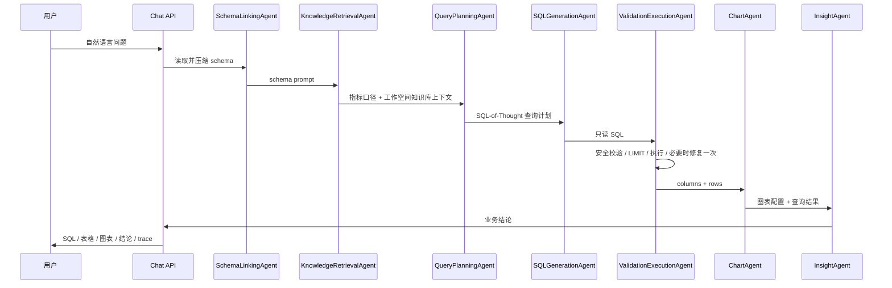

# V4.0.0 SQL-of-Thought 多智能体架构设计

V4 的目标不是为了“堆多智能体概念”，而是把原来一条很长的 AI 查数链路拆成更清楚、可观测、可测试、可继续扩展的工程结构。第一版仍然只支持单个业务数据库，先把 Text-to-SQL 的稳定性、可解释性和扩展边界打牢，后续再升级多库路由、MCP 工具化和 Agent 评测。

## 为什么做这一版

V1 到 V3 已经完成了自然语言查数、PromptOps、RAG 指标口径、多租户产品库、系统设置和知识库隔离。继续往下走，如果还把所有逻辑堆在一个 Orchestrator 里，会出现几个问题：

- schema 读取、知识检索、SQL 生成、SQL 修复、图表推荐和结论生成混在一起，后续不好独立调试。
- 每个步骤使用什么模型、什么 prompt、什么策略边界不够清楚。
- 后续如果接入多库、MCP 或多个 Agent 独立评测，原结构会变得越来越重。
- 面试或项目展示时，别人很难一眼看出系统已经从 Demo 进入产品化架构。

所以 V4 用 SQL-of-Thought 思路做一次拆分：先让系统形成“查询计划”，再让 SQL Agent 基于 schema、指标口径、知识库资料和计划生成 SQL，而不是直接从用户问题一步跳到 SQL。

## Agent 拆分

| Agent | 责任 | 当前输入 | 当前输出 |
| --- | --- | --- | --- |
| SchemaLinkingAgent | 读取业务库 schema，并压缩成 prompt 可用文本 | SQLAlchemy Engine | schema overview、schema prompt |
| KnowledgeRetrievalAgent | 检索指标口径和工作空间知识库 | 用户问题、tenant/workspace/knowledge_base scope | retrieval context |
| QueryPlanningAgent | 生成 SQL-of-Thought 查询计划 | 用户问题、schema、检索结果 | SQLThoughtPlan |
| SQLGenerationAgent | 生成只读 SQL | 用户问题、schema prompt、retrieval context、query plan | GeneratedSQL |
| ValidationExecutionAgent | 执行安全策略、SQL 校验、查询执行和一次修复 | GeneratedSQL、安全策略、Engine | safe_sql、columns、rows、repair_count |
| ChartAgent | 根据结果推荐 ECharts 图表 | columns、rows、question | chart config |
| InsightAgent | 基于真实查询结果生成业务结论 | question、safe_sql、rows | insight |

当前这些 Agent 仍然运行在同一个 Python 进程里，属于“结构化多智能体编排”。这样做的好处是风险低、改造成本小，同时已经把边界留出来。后续可以把某些 Agent 独立成任务队列、MCP Tool 或专门的模型 Profile。

## 执行链路

## 为什么 trace 名称保持兼容

前端已经依赖 `generate_sql`、`execute_sql`、`sql_repair`、`chart`、`insight` 这些 trace 名称来判断结果状态、渲染分析过程和恢复历史对话。V4 不直接改外层协议，而是在 detail 里标明对应 Agent，例如：

- `generate_sql`：`SQLGenerationAgent: ...`
- `execute_sql`：`ValidationExecutionAgent 返回 5 行`
- `chart`：`ChartAgent: bar`

这样做可以让后端架构升级，但前端和历史数据不需要大改。稳定接口比炫技更重要。

## 单库到多库怎么升级

V4.0.0 先做单库，是为了把每个 Agent 的责任拆清楚。后续多库可以自然扩展：

1. 在 SchemaLinkingAgent 前增加 DataSourceRouterAgent，根据用户问题、工作空间权限和数据源描述选择候选数据源。
2. SchemaLinkingAgent 从“读取一个 Engine”升级为“读取候选数据源 schema 快照”。
3. QueryPlanningAgent 生成计划时标注数据源、表和 JOIN 边界。
4. ValidationExecutionAgent 按数据源执行，不允许跨越未授权库。
5. Evaluation 模块按 Agent 维度统计路由准确率、SQL 正确率和修复成功率。

这条路径不会推翻 V4.0.0，只是在现有 Agent 前后加节点。

## 后续版本建议

- V4.1：增加 Agent 级评测指标，例如 schema linking 命中率、检索命中率、SQL 修复成功率。
- V4.2：模型配置里的 Agent Binding 真正接入编排器，让 SQL、Insight、RAG Agent 可使用不同模型 Profile。
- V4.3：引入 DataSourceRouterAgent，开始支持多数据源候选选择。
- V5：将数据库查询、图表生成、文件导出等能力包装为 MCP Tool。
- V6：多库、多 Agent 协作与企业级权限审计。